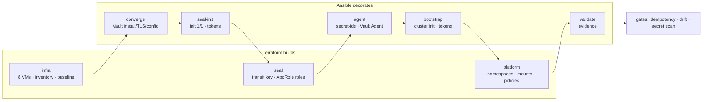

# Architecture

golden_ticket builds the red_pass lab — eight RHEL 9.8 ARM64 Multipass VMs
running Vault Enterprise with a seal chain — with **Terraform and Ansible
together**. The rule that settles every ownership question:

> **Terraform builds the house. Ansible decorates it.**

## Ownership

| Domain | Owner | How |
| --- | --- | --- |
| VMs, sizing, cloud-init | Terraform `terraform/infra` | `todoroff/multipass`; topology defined once in `nodes.auto.tfvars.json` |
| Inventory | Terraform declares, Ansible reads | `ansible_host`/`ansible_group` resources → `cloud.terraform.terraform_provider` inventory plugin |
| RHEL baseline | Ansible, started by Terraform | `ansible_playbook.baseline` in `terraform/infra` (content-digest re-run via `replace_triggered_by`) |
| Vault install, TLS, licence, config | Ansible | `converge.yml` |
| Init, unseal, raft join, bootstrap tokens | Ansible | `seal-init.yml`, `bootstrap.yml` |
| Seal Vault structure (transit mount + key, policies, AppRole roles) | Terraform `terraform/seal` | Vault provider → `gt-vault-s` |
| Secret-ids, Vault Agent, rotator | Ansible | `agent.yml` |
| Cluster structure (namespaces, mounts, `secret/`, engines, policies, token roles) | Terraform `terraform/platform` | Vault provider → the active node |
| Validation and evidence | Ansible | `validate.yml` → `.build/validation.json` |
| Phase order and gates | Make | `scripts/phases.txt`, `scripts/lab.sh` |

## The boundary Vault enforces

Each tool has its own token, with its own policy, on each Vault. Ansible writes
these four bootstrap policies with the root token (they are what let each tool
in, so Terraform never manages them); afterwards the root tokens are
break-glass only.

| Vault | Terraform (structure) | Ansible (configuration) |
| --- | --- | --- |
| `gt-vault-s` | `gt-tf-seal`: transit mount + key, seal policies, AppRole mount + roles — never a secret-id | `gt-ansible-seal`: read role-ids, mint/destroy secret-ids — never a mount, policy or role |
| cluster | `gt-tf-platform`: namespaces, mounts, ACL policies, token roles, licence status — never an auth method, identity or secret data; never delete `secret/` | `gt-ansible-platform`: auth methods, identity groups/aliases, `secret/data/golden-ticket/*`, tokens via Terraform-made roles — never a mount or policy |

`make boundary` proves it with `sys/capabilities-self` (19 checks).

## Phases



`scripts/phases.txt` is the only phase list; `make lab`, `make idempotency`,
`make drift`, the automation digest and `.build/layers.json` all read it.
There is no `site.yml`: Ansible alone can no longer run the lab, because
three of the phases are Terraform.

## Contracts between the tools

| From → to | Contract | Where |
| --- | --- | --- |
| Terraform → Ansible | inventory: hosts, groups, `gt_role`, `vault_role`, sizing | `terraform/infra/inventory.tf` → inventory plugin |
| Terraform → Ansible (baseline) | node map in `extra_vars` (in-graph, first apply) | `terraform/infra/baseline.tf` |
| Terraform → everyone | `lab_nodes` output (the substrate contract) | `terraform/infra/outputs.tf` |
| Ansible → Terraform | scoped tokens in `.secrets/tokens/`, exported only as `VAULT_TOKEN` | `scripts/tf-run.sh` |
| Terraform → Ansible (validation) | declared namespaces, mounts, policies, token roles | `terraform/platform` outputs → `validate.yml` |

## The seal chain

```text
gt-vault-s (Shamir 1/1) ── transit/keys/autounseal          terraform/seal
     ▲  AppRole gt-seal-autounseal (bound to the agent's /32)
gt-agent-1  Vault Agent, api_proxy force token, mTLS :8100  ansible/agent.yml
     ▲  each node's own client certificate, no token
gt-vault-1..3  seal "transit"                               ansible/converge.yml
```

## The front door

```text
                     you (browser / CLI)   TLS (lab CA)
                               │
                         gt-proxy-1   HAProxy — TLS in, verified TLS out (verifyhost)
   ┌────────────┬──────────────┼──────────────┬───────────────┬──────────────┐
 :8200        :8202          :8210          :443            :8443          :9000
 active node  any unsealed   seal Vault     console         Keycloak       /node/<name>/…
 (writes, UI) (reads)        (operator)     gt-ux-1         gt-identity-1  one node
```

Backends come from the Terraform inventory, never from literals. The
Keycloak issuer, Vault's OIDC callbacks and the console's origins point at the
front door from day one (in red_pass they had to be re-pointed later). Stats
(:8404) need the password Ansible generated into `secret/golden-ticket/proxy`;
the config holds only its sha512-crypt hash.

See [operations.md](operations.md) for cold start, restarts, rotation and the
drift demos, and [decisions.md](decisions.md) for the evidence behind each
non-obvious choice.
